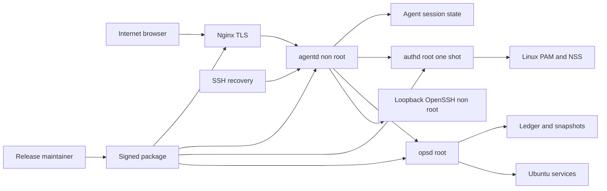

# JW Agent Threat Model

Status: Accepted  
Authority: Security  
Owner: Security Maintainer  
Last reviewed: 2026-07-22

## Executive summary

최상위 위험은 credential stuffing, 공개 HTTP input으로 agentd를 침해한 뒤 root authd·opsd 경계를 공격하는 연쇄 경로, PAM FFI 결함, P2 path·crash recovery 오류, OpenSSH manual session 탈취, Certbot 외부효과와 package 공급망입니다. P2 Nginx site-state·active managed-config, Certbot one-shot renewal dry-run·guided issuance CA 실패와 보호 vhost attach의 SNI read-back·강제 실패 원복, non-root OpenSSH terminal과 home-scoped read-only SFTP는 전용 Ubuntu 24.04 VM에서 package·PAM·TLS·실패·비밀 비노출·원장 훼손 `VM_PASS`를 획득했습니다. 다만 private-LAN `.test` 호스트와 unsigned local package 증거이므로 공인 CA 발급 성공·SFTP 쓰기·운영 안전으로 과장하지 않습니다.

## Scope and assumptions

In scope:

- P1 governance와 `p1-local`·`p1-browser` xtask lane
- opt-in Nginx public 443 UDS template와 loopback SSH recovery listener
- 구현된 agentd, one-shot authd, ffi-pam, typed-operation opsd
- Linux PAM local account, Linux group role, server-side session
- SQLite session/settings, Nginx observation, public ingress packaging basis
- mobile·tablet·desktop responsive web
- 구현된 P2 safety kernel·Nginx site state·active managed config와 Certbot lifecycle 설계
- existing OpenSSH 기반 non-root terminal과 home-scoped read-only SFTP 구현

Out of scope:

- central management, tenant/customer data, PostgreSQL, billing
- LDAP·SSSD·Kerberos·multi-prompt PAM support claim
- opsd arbitrary shell·PTY·user argv, root terminal, generic root file manager
- central relay와 release artifact
- OpenSSH·Nginx·PAM 자체 취약점 수정
- root를 이미 완전히 장악한 공격자에 대한 절대 불변 로그

Key assumptions:

- public mode is explicit opt-in and only Nginx 443 is Internet reachable.
- Nginx uses a dedicated UDS to agentd; agentd direct public TCP is disabled.
- authd and opsd are separate root networkless UDS boundaries.
- MVP verifies Ubuntu 24.04 local pam_unix only.
- root web login is denied; explicit Linux groups grant product roles.
- SSH recovery remains usable when Nginx/TLS/public mode fails.

사용자가 제공한 배포 전제는 단일 Ubuntu 24.04 서버, 기본 loopback, 명시적 public FQDN/TLS, local pam_unix, 제품 role group, 중앙관제 제외입니다. 다음 항목은 위험 순위를 바꿀 수 있습니다.

- accepted TOTP additional-auth 계약의 구현·key custody·recovery ceremony 검증 깊이
- Certbot production ACME용 disposable domain·rate budget과 실제 VM 증거
- OpenSSH credential broker와 SFTP REALPATH의 TOCTOU 잔여 위험
- CDN·외부 reverse proxy 앞 배포 허용 여부와 실제 client IP 신뢰 모델
- PAM FFI 독립 검토와 Ubuntu adversarial test 깊이

## System model

### Primary components

- Browser: public/recovery login, responsive task UI, session cookie
- Nginx+Certbot: public TLS, request limits, proxy metadata
- agentd: non-root REST/SSE, session, observation, UI projection
- authd+ffi-pam: root one-shot PAM/account/role verification
- opsd: root typed safety executor; private network namespace 안에서 Nginx config test에 필요한 address family와 `CAP_NET_BIND_SERVICE`만 갖고 외부 interface·listener는 없음
- OpenSSH: agentd loopback client의 non-root terminal·SFTP backend
- Ubuntu services: PAM/NSS, systemd, Nginx and observed services
- Local stores: agentd session/settings SQLite와 opsd WAL/FULL ledger·checkpoint·snapshot authority
- xtask/release: local gate registry and signed artifact evidence

### Data flows and trust boundaries

- Internet Browser → Nginx: username/password, session cookie, API input over HTTPS; TLS, Host and rate/body/time limits required.
- Nginx → agentd: rewritten proxy metadata and REST/SSE over dedicated UDS; only this channel may supply trusted remote address.
- SSH Recovery Browser → agentd: 127.0.0.1-only HTTP over encrypted SSH tunnel; proxy headers ignored, separate short recovery session namespace.
- agentd → authd: password-bearing one-request bounded frame over UDS; peer UID, timeout, zeroize and generic response required.
- authd → PAM/NSS: password, service name, remote address; authenticate, account check, canonical user and group role.
- agentd → opsd: versioned typed UDS; password·path·shell·user argv never cross.
- opsd → Ubuntu/Nginx/Certbot: allowlisted resource, fixed argv, snapshot·read-back·rollback; first implementation is Nginx site state.
- agentd → loopback OpenSSH: short-lived user-bound ticket, strict host key and non-root Linux identity; opsd를 통과하지 않음.
- daemon → local stores: session digest, observation, ledger, snapshot; ownership, transaction, fsync, quota and secret exclusion required.
- Maintainer → package → Host: root binaries, PAM policy, systemd socket, Nginx template; signature, SBOM and install evidence required.

#### Diagram

## Assets and security objectives

| Asset | Why it matters | Security objective |
|---|---|---|
| Linux password in transit/memory | 탈취 시 SSH·sudo 등 다른 서비스까지 영향 | C/I |
| authd root/PAM FFI boundary | memory/logic flaw가 root compromise로 확대 | I/A |
| opsd root authority | 오용 시 host configuration 무결성 상실 | I/A |
| web session and step-up claim | 관리자 impersonation과 operation 승인 | C/I |
| TLS certificate/private key | public endpoint identity와 credential 보호 | C/I/A |
| proxy metadata/Host policy | rate-limit, origin, audit identity | I |
| service configuration | 웹 서비스 중단·노출 | I/A |
| plan/capability decision | 승인 범위와 실제 변경 일치 | I |
| ledger/snapshots | 사고 재구성·G2 rollback | C/I/A |
| release artifact/signing key | 모든 설치 host의 공급망 신뢰 | C/I/A |
| OpenSSH session/ticket | 수동 명령·파일 접근 권한 | C/I/A |
| certificate issuance state | CA rate budget·public endpoint identity | C/I/A |

## Attacker model

### Capabilities

- Internet attacker can send arbitrary HTTP requests, credential guesses, slow/large inputs and reconnect storms to Nginx.
- Attacker may possess reused Linux credentials or a stolen mobile/browser session.
- Local unprivileged attacker may connect to loopback surfaces or probe Unix socket permissions.
- Malicious config/symlink or concurrent root change may race a supported operation.
- Supply-chain attacker may target dependencies, package upload or signing key.
- Authenticated operator or stolen session may run irreversible terminal/SFTP actions within that Linux user's privileges.

### Non-capabilities

- Internet attacker cannot directly connect to agentd internal TCP/UDS, authd or opsd if architecture holds.
- Browser file input is a bounded relative home path only; absolute/system path, OpenSSH argv와 opsd path·shell input이 될 수 없습니다.
- Product cannot permanently constrain an already-root attacker or prove who used root outside the product.
- Central tenant boundary does not exist in MVP and is not included.

## Entry points and attack surfaces

| Surface | How reached | Trust boundary | Notes | Evidence |
|---|---|---|---|---|
| Public Nginx 443 | Internet | browser → edge | TLS, rate, Host, proxy rewrite | `docs/20-architecture/public-ingress.md` |
| Login/reauth REST | Nginx UDS or loopback | browser → agentd | password, enumeration, CSRF, session | `docs/40-contracts/local-interfaces.md` |
| authd socket | agentd service UID | agentd → root authd | PAM FFI and credential oracle | `docs/70-security/pam-authentication.md` |
| opsd socket | agentd service UID | agentd → root opsd | privileged typed operation | `docs/20-architecture/system-context.md` |
| Nginx site operation (P2 active) | approved plan | opsd → filesystem/systemd | VM success·rollback·disk·lockdown proof | `docs/90-specs/operations/nginx-site-state-set-v1.md` |
| Managed config (P2B active) | approved G2 plan | opsd → active allowlisted Nginx file/service | VM exact rollback·drift·inactive·temp cleanup proof | `docs/90-specs/operations/managed-config-file-v1.md` |
| Certbot lifecycle (P2) | approved G1/G2 plan | opsd → Certbot/Nginx/CA | external issuance and secret risk | `docs/90-specs/operations/certbot-certificate-v1.md` |
| Terminal/SFTP (P2) | approved manual session | agentd → loopback OpenSSH | terminal G1; SFTP read G0; SFTP write absent | `docs/90-specs/access/openssh-terminal-sftp-v1.md` |
| Public access operation (planned) | SSH-authenticated admin | opsd → Nginx/UFW | P1은 수동 opt-in template만 제공 | `docs/90-specs/operations/public-access-profile-v1.md` |
| SQLite/snapshot files | daemon runtime | process → durable state | crash, disk full, tamper | `docs/20-architecture/state-ownership.md` |
| Limited logs/SSE | authenticated browser | browser → agentd → journal | data exposure and DoS | `docs/10-product/mvp-scope.md` |
| Package/PAM/systemd scripts | local package manager | artifact → root host | supply chain and auth policy | `docs/80-delivery/packaging-release.md` |
| P1 xtask CLI | local maintainer | developer → build tool | local/governance/browser executable gates | `xtask/src/main.rs` |

## Top abuse paths

1. 공격자가 재사용된 Linux password를 credential stuffing으로 찾아 admin session을 발급받고 supported operation을 승인합니다.
2. 공격자가 공개 JSON/SSE parser bug로 agentd를 장악하고 authd 또는 opsd UDS의 typed policy 결함을 연쇄 공격합니다.
3. crafted PAM input·module behavior가 ffi-pam의 memory/ownership 결함을 유발해 one-shot root authd에서 code execution을 얻습니다.
4. 공격자가 CSRF·XSS·session fixation·공유 mobile session을 이용해 사용자의 plan approval을 가로챕니다.
5. 분산된 login failure로 Linux account를 잠그거나 PAM worker queue를 고갈시켜 관리·SSH 복구를 방해합니다.
6. Host/proxy header를 속여 source budget, Origin 판단 또는 감사 attribution을 우회합니다.
7. local attacker가 `jw-agent` UID 또는 socket 권한을 얻어 authd를 credential oracle로 사용하거나 opsd parser를 반복 공격합니다.
8. password/PAM error/session token이 journal·DB·trace·mobile cache에 남아 후속 credential compromise로 이어집니다.
9. 운영자가 잘못된 FQDN·certificate·Nginx template을 수동 활성화해 public 관리 경로를 노출하거나 복구 경로를 오판합니다.
10. 악성 package나 signing key로 authd/opsd root code를 정상 update처럼 배포합니다.
11. 탈취된 session이나 잘못된 재인증으로 비-root terminal·SFTP를 열고 sudo 또는 writable service file을 악용합니다.
12. Certbot production issuance가 성공한 뒤 attach가 실패하거나 반복 retry되어 CA rate budget과 public TLS 상태가 꼬입니다.

## Threat model table

| Threat ID | Threat source | Prerequisites | Threat action | Impact | Impacted assets | Existing controls (evidence) | Gaps | Recommended mitigations | Detection ideas | Likelihood | Impact severity | Priority |
|---|---|---|---|---|---|---|---|---|---|---|---|---|
| TM-001 | Internet credential attacker | public mode and valid/reused Linux account password | credential stuffing then product login or later SSH reuse | account compromise and management data exposure | password, session, host | root deny/group role in `crates/jw-authd/src/lib.rs`; app budgets in `crates/jw-agentd/src/api.rs`; edge template limit; limiter exhaustion 전후 Linux account와 SSH key recovery VM 검증 | distributed/CDN rate model과 accepted TOTP provider 구현 없음 | keep limiter/SSH regression gate, implement accepted TOTP contract only after P2 entry | source/subject/global failures, success-after-fail alert | high | high | critical |
| TM-002 | remote input attacker | parser/session bug in public agentd | agentd compromise then authd/opsd UDS abuse | root helper attack and host integrity loss | agentd, authd, opsd, host | body/frame caps, UDS-only listeners, peer UID and systemd sandboxes in `crates/` and `packaging/systemd/` | Linux socket/sandbox negatives and parser fuzzing 없음 | VM peer/malformed/timeout tests, parser fuzz targets, keep opsd typed and read-only until P2 gate | socket rejection, daemon crash/restart metrics | medium | high | critical |
| TM-003 | PAM/FFI attacker | crafted conversation or unsafe binding flaw | root authd memory/logic compromise | root code execution or credential theft | password, authd, host | isolated `ffi-pam`, bounded single-secret conversation, one-shot authd, no network, zeroizing buffers | independent unsafe review and real PAM adversarial evidence 없음 | audit pointer ownership, run sanitizer/fuzz fixture where supported, VM multi-prompt/timeout/crash cases | authd crash, unsupported conversation and timeout events | medium | high | critical |
| TM-004 | web attacker/session thief | XSS, CSRF, stolen browser or recovery session | impersonate role or alter access policy | sensitive reads and weakened future policy | session, settings | digest-only opaque sessions, rotation, exact Host/Origin, CSRF, ingress split, CSP/no-store and single-use reauth; real HTTPS browser expiry recovery 검증 | public-disable session revoke와 shared-device cache의 운영 브라우저 증거 없음 | preserve real-edge Playwright regression, verify revoke-on-public-disable before P2 activation | session lifecycle, ingress mismatch, rejected Origin | medium | high | high |
| TM-005 | distributed login attacker | public PAM endpoint | exhaust product login budget or one-shot auth workers | product login DoS | PAM account, authd availability | edge+app rate limits, 8s broker timeout, no `pam_faillock`, socket activation isolation; repeated-failure VM proof confirms Linux password state and SSH key recovery remain usable | distributed-source and sustained activation pressure not load-tested | preserve no-persistent-lockout policy, add bounded activation/load evidence before public release | activation count, PAM timeout, source diversity | high | medium | high |
| TM-006 | remote/local requester | proxy/Host trust confusion | spoof source, Host or Origin | rate/origin/audit bypass | proxy metadata, session | dedicated public UDS, header clearing/template rewrite, exact boundary tests and Nginx effective-config/public-port VM proof | alternate proxy/CDN topology unsupported and unverified | keep unsupported topology fail-closed; require a new trust contract before CDN support | rejected Host/source/channel mismatch | medium | high | high |
| TM-007 | local attacker | access to service UID or runtime socket | invoke authd or flood opsd directly | credential oracle or root parser pressure | password boundary, helper availability | socket modes, SO_PEERCRED, bounded opsd connections and wrong-UID Ubuntu VM rejection | socket replacement and restart-race depth remains limited | retain wrong-UID gate; add race/fault matrix only when mutable P2 opsd exists | peer UID denial and request rejection counts | medium | high | high |
| TM-008 | P2 authenticated attacker | typed write primitive has path/race flaw | exploit symlink/path/TOCTOU or expose internal temp as a site | arbitrary root path change or unsafe activation | config, host | no user path/argv, no-follow/root ownership, stable IDs, protected marker, active exact symlink, temp namespace exclusion/startup cleanup, VM drift/inactive proof | microsecond concurrent-drift race depth remains limited | retain protected/outside-link/temp regression; add concurrent stress | path-policy denial and unexpected inode/digest | low | high | high |
| TM-009 | P2 fault actor | durable operation is killed or disk fills | cause repeated apply or failed recovery | service outage or config loss | ledger, snapshot, config | SQLite WAL/FULL, chained events/checkpoint, whole-request opsd serialization, snapshot fsync, read-back, rollback, disk-full cancellation and checkpoint-deletion VM lockdown | every-durable-stage SIGKILL matrix remains incomplete | add restart-at-each-stage matrix before broader adapter rollout | recovery-required, disk and continuity alert | medium | high | critical |
| TM-010 | service output/developer error | secret reaches log/error/cache | persist password/session/PAM text | credential/session compromise | passwords, logs, sessions | `SecretString`, zeroize, digest-only DB, core-dump denial, no browser storage, generic errors and VM journal/DB/argv/package/evidence canary scan | external PAM module copies and crash dump handling outside process boundary cannot be claimed erased | preserve secret scan and keep password out of argv/logging; document FFI ownership limit | redaction gate and secret canary failure | medium | high | high |
| TM-011 | supply-chain attacker | source/dependency/signing path compromise | malicious package deployment | multi-host root compromise | signing key, artifact, all hosts | pinned lockfiles, no git dependency, no remote Actions, local gates and checksum-pinned Ubuntu package install/upgrade/remove evidence | signer/SBOM/reproducible release lane 없음 | isolated signing key, SBOM, signed manifest, install/repro/revocation procedure before release claim | signature/source/repro mismatch | low | high | high |
| TM-012 | shared-device/local browser user | operator leaves mobile session active | reuse session or cached screen | unauthorized read and policy change attempt | session, settings | memory-only CSRF, no service worker/storage, short server expiry, logout cookie/cache clear; mock viewport와 real HTTPS expired-session recovery | mobile background 복귀와 shared-device cache의 장시간 운영 증거 없음 | add background state check and shared-device cache scenario before public release | concurrent session and expiry anomaly | medium | medium | medium |
| TM-013 | stolen authenticated session | terminal/SFTP session issuance allowed | terminal command 실행 또는 홈 파일 열람; 향후 writable surface 악용 | service/data compromise or home-data disclosure within user/sudo rights | OpenSSH account, host data | non-root, PAM reauth, session/origin binding, fixed OpenSSH argv; SFTP read-only message allowlist, canonical home, limits, path-digest audit와 VM traversal/symlink/session proof | SFTP REALPATH 검사 뒤 race 잔여 위험; SFTP write 미구현; terminal sudo/root와 idle/max/frame fault 깊이 부족 | preserve UID0 denial, keep G1 write separate, add race·sudo/root·timeout/frame negatives before release | metadata-only start/end, close reason, byte count, action/path digest, policy denial | medium | high | critical |
| TM-014 | operator/remote fault | Certbot production request or retry | consume rate budget; issuance succeeds but attach fails | TLS outage or unmanaged certificate | certificate, rate budget, Nginx | staging-first, typed domain/plugin, G1/G2 split and local rollback contract | public CA disposable domain proof 없음 | production lane budget, idempotency, SAN/chain read-back and attach rollback | CA class, cert fingerprint, attach/recovery state | medium | high | high |

Risk ranking depends most on public exposure, selected additional-auth policy, authd FFI quality and SSH fallback. 검증된 provider가 `risky_operations` 또는 `all_mutations`에 활성화되면 TM-001 likelihood를 다시 평가합니다.

## Criticality calibration

- Critical: realistic public path from credential/parser/PAM FFI to admin session or root boundary compromise; signing-key compromise with broad package delivery.
- High: authenticated/session abuse, proxy trust bypass, protected-vhost self-lockout, path escape, unrecoverable state corruption, credential leakage.
- Medium: bounded endpoint DoS with recovery, shared-device read exposure, partial non-secret host metadata leak.
- Low: easy-to-recover UI defect, non-sensitive version banner, theoretical path with no attacker-controlled input.

Critical은 단순 impact가 아니라 공개 prerequisite와 현실적 exploit chain이 함께 있을 때 사용합니다.

## Focus paths for security review

| Path | Why it matters | Related Threat IDs |
|---|---|---|
| `CONSTITUTION.md` | public/PAM/root 불변식과 예외 금지 | TM-002, TM-003 |
| `docs/20-architecture/public-ingress.md` | public trust metadata와 protected resource | TM-005, TM-006, TM-007 |
| `docs/70-security/pam-authentication.md` | password와 root authd lifecycle | TM-001, TM-003, TM-005, TM-010 |
| `docs/70-security/privilege-and-auth.md` | role, session, CSRF, step-up | TM-001, TM-004 |
| `docs/40-contracts/local-interfaces.md` | public REST와 두 root UDS parser | TM-002, TM-003, TM-006 |
| `docs/20-architecture/state-ownership.md` | session/ledger/snapshot authority | TM-009, TM-010 |
| `docs/90-specs/auth/pam-login-v1.md` | exact PAM input/output/failure semantics | TM-001, TM-003, TM-005 |
| `docs/90-specs/operations/public-access-profile-v1.md` | Nginx/UFW self-lockout path | TM-006, TM-007 |
| `docs/90-specs/operations/nginx-site-state-set-v1.md` | first service write path | TM-008, TM-009 |
| `docs/90-specs/operations/managed-config-file-v1.md` | root file validation and rollback | TM-008, TM-009 |
| `docs/90-specs/operations/certbot-certificate-v1.md` | CA external effect and local attach | TM-014 |
| `docs/90-specs/access/openssh-terminal-sftp-v1.md` | non-root manual irreversible surface | TM-004, TM-013 |
| `docs/60-ui-ux/interaction-accessibility.md` | mobile session and reauth UX | TM-004, TM-012 |
| `docs/80-delivery/packaging-release.md` | PAM/systemd/Nginx root package surface | TM-003, TM-011 |
| `xtask/src/main.rs` | current local trust gate | TM-011 |

가장 우선할 실제 검토 경로는 `crates/jw-agentd/src/api.rs`, `crates/jw-agentd/src/session.rs`, `crates/jw-authd/src/main.rs`, `crates/ffi-pam/src/linux.rs`, `crates/jw-opsd/src/main.rs`, P2 ledger/filesystem/runner modules, `packaging/systemd/`, `packaging/nginx/`입니다.

## Quality check

- P1 public HTTPS template, recovery, REST, authd/PAM, opsd capability, DB, package, xtask와 P2 active operation·terminal·read-only SFTP surfaces를 포함했습니다.
- 모든 trust boundary를 하나 이상의 threat와 연결했습니다.
- 현재 P2 local·browser·Ubuntu VM control, unsigned/test-CA 한계, terminal·SFTP G0 VM proof와 SFTP write 미구현을 분리했습니다.
- public Internet attacker, local attacker, shared mobile, supply chain을 구분했습니다.
- accepted TOTP 계약, unsupported upstream proxy model, P1 existing-certificate 범위와 PAM FFI 잔여 한계를 구분했습니다.
